.. _getting_started:

===============
Getting Started
===============

In this tutorial, we are going to use ``example_project`` and its ``open_news`` app to walk you through how to integrate ``Scrapy Django Dashboard`` into a typical Django project.

The tutorial itself can be roughly divided into two parts: 

  * :ref:`part_one`: Set up example project, open news app and a Scrapy spider.

  * :ref:`part_two`: Create parameters in Django admin dashboard accordingly.

.. Note::
    GitHub_ has **ALREADY** included the source code of this sample project.

.. _GitHub: https://github.com/0xboz/scrapy_django_dashboard

.. _project_summary:

Project Summary
---------------

The code scrapes the news URLs, thumbnails and excerpts from the main page of WikiNews_. Further, it collects the news title from each news detail page. This might sound redundant at first, but it is a selected way to demonstrate the difference in ``Main Page (MP)`` and ``Detail Page (DP)`` as we deploy the spiders in a real project. 

.. _Wikinews: http://en.wikinews.org/wiki/Main_Page

.. Note::

  The following instructions assume you have already finished the :ref:`installation` successfully. ``(venv)`` means a virtual environment is activated in advance, which is considered as the best practice when running the code without the potential breaking OS global packages.

.. _part_one:

PART I
--------

In Part I, we will mainly use prompt commands and a text editor to generate a minimal amount of boilerplate and other setting files manually. 

.. _creating_example_project:

Creating Example Project 
^^^^^^^^^^^^^^^^^^^^^^^^

Run this command: ::

    (venv) django-admin startproject example_project

.. note::

  This might not be the best practice when starting a new Django project, according to The `Hitchhikers' Guide to Python`_, which suggests the following command instead to avoid repetitive paths by appending ``.`` at the end. ::

    (venv) django-admin startproject example_project . 

  However, this tutorial sticks with `the official Django Tutorial Part 1`_ for the sake of consistency.

.. _`Hitchhikers' Guide to Python`: https://docs.python-guide.org/writing/structure/#regarding-django-applications

.. _`the official Django Tutorial Part 1`: https://docs.djangoproject.com/en/3.0/intro/tutorial01/#creating-a-project

This results in a ``example_project/`` in the root directory with a directory tree like this: ::

    example_project/  
        example_project/
            __init__.py  
            settings.py  
            urls.py  
            wsgi.py  
        manage.py  

Now, let us navigate into ``example_project/``. ::

    (venv) cd example_project

Add ``scrapy_django_dashboard`` into ``INSTALLED_APPS`` in ``settings.py``. For more detailed comments, check out `example_project/example_project/settings.py`_ on `GitHub`_.  

.. _`example_project/example_project/settings.py`:  https://github.com/0xboz/scrapy_django_dashboard/blob/master/example_project/example_project/settings.py

.. _creating_open_news_app:

Creating Open News App
^^^^^^^^^^^^^^^^^^^^^^

Next, we create ``open_news`` app by running this command in ``example_project/example_project/`` (where ``manage.py`` resides). ::

    (venv) python manage.py startapp open_news

This results in a ``open_news/`` with a directory tree like this: ::

    open_news/  
        migrations/
            __init__.py
        __init__.py  
        admin.py
        apps.py
        models.py
        tests.py
        views.py

.. _creating_open_news_app_models:

Creating Open News App Models
^^^^^^^^^^^^^^^^^^^^^^^^^^^^^

In ``open_news`` app, we need to create at least *two model classes*. The first class stores the scraped data (``Articles`` in our example), and the second one (``NewsWebsite`` in our example) acts as a reference model class defining the ``origin/category/topic`` where the scraped items belong to. 

Here is our ``model.py``. ::

  # example_project/example_project/open_news/model.py

  from __future__ import unicode_literals
  from django.db import models
  from django.db.models.signals import pre_delete
  from django.dispatch import receiver
  from scrapy_djangoitem import DjangoItem
  from scrapy_django_dashboard.models import Scraper, SchedulerRuntime
  from six import python_2_unicode_compatible

  @python_2_unicode_compatible
  class NewsWebsite(models.Model):
      name = models.CharField(max_length=200)
      url = models.URLField()
      scraper = models.ForeignKey(
          Scraper, blank=True, null=True, on_delete=models.SET_NULL)
      scraper_runtime = models.ForeignKey(
          SchedulerRuntime, blank=True, null=True, on_delete=models.SET_NULL)

      def __str__(self):
          return self.name

  @python_2_unicode_compatible
  class Article(models.Model):
      title = models.CharField(max_length=200)
      news_website = models.ForeignKey(
          NewsWebsite, blank=True, null=True, on_delete=models.SET_NULL)
      description = models.TextField(blank=True)
      url = models.URLField(blank=True)
      thumbnail = models.CharField(max_length=200, blank=True)
      checker_runtime = models.ForeignKey(
          SchedulerRuntime, blank=True, null=True, on_delete=models.SET_NULL)

      def __str__(self):
          return self.title

  class ArticleItem(DjangoItem):
      django_model = Article

  @receiver(pre_delete)
  def pre_delete_handler(sender, instance, using, **kwargs):
      if isinstance(instance, NewsWebsite):
          if instance.scraper_runtime:
              instance.scraper_runtime.delete()

      if isinstance(instance, Article):
          if instance.checker_runtime:
              instance.checker_runtime.delete()

  pre_delete.connect(pre_delete_handler)

We have defined some foreign key fields referencing ``Scrapy Django Dashboard`` models. The ``NewsWebsite`` class refers to the :ref:`scraper` model, which contains the main scraper with information about how to scrape the attributes of the article objects. The ``scraper_runtime`` field is a reference to the :ref:`scheduler_runtime` class from ``Scrapy Django Dashboard`` models. This object stores the scraper schedules. 

The ``NewsWebsite`` class also has to provide the url to be used during the scraping process. You can either use (if existing) the representative url field of the model class, which is pointing to the nicely-layouted overview news page also visited by the user. In this case we are choosing this way with taking the ``url`` attribute of the model class as the scrape url. However, it often makes sense to provide a dedicated ``scrape_url`` (you can name the attribute freely) field for cases, when the representative url differs from the scrape url (e.g. if list content is loaded via ajax, or if you want to use another format of the content - e.g. the rss feed - for scraping).

The ``Article`` model class has a class attribute called ``checker_runtime``, a reference to :ref:`scheduler_runtime` ``Scrapy Django Dashboard`` model class. This scheduling object holds information about the next check and evaluates if the news article still exists or it can be deleted (see :ref:`item_checkers`) by using the ``url`` of ``Article``.

Last but not least, ``Scrapy Django Dashboard`` uses the DjangoItem_ class from Scrapy to store the scraped data into the database.

.. _DjangoItem: https://scrapy.readthedocs.org/en/latest/topics/djangoitem.html

.. note::

   To have a loose coupling between the runtime objects and the domain model objects, we declare the foreign keys to the ``Scrapy Django Dashboard`` objects with ``blank=True, null=True, on_delete=models.SET_NULL``. This prevents the reference object and the associated scraped objects from being deleted when we remove a ``Scrapy Django Dashboard`` object by accident.

.. note::

  When we delete model objects via the Django admin dashboard, the runtime objects are not removed. To enable this feature,use `Django's pre_delete signals`_ in your ``models.py`` to delete e.g. the ``checker_runtime`` when deleting an article ::

    @receiver(pre_delete)
    def pre_delete_handler(sender, instance, using, **kwargs):
        ....
        
        if isinstance(instance, Article):
            if instance.checker_runtime:
                instance.checker_runtime.delete()
                
    pre_delete.connect(pre_delete_handler)

.. _`Django's pre_delete signals`: https://docs.djangoproject.com/en/dev/topics/db/models/#overriding-model-methods

.. _configuring_scrapy:

Configuring Scrapy
^^^^^^^^^^^^^^^^^^

The common way to start a Scrapy project with boilerplate files is to run: ::

  scrapy startproject my_scrapy_project

However, this approach does not save much time down the road, because the boilerplate code can not directly interact with ``Scrapy Django Dashboard`` app without manual configuration.

Therefore, **the preferred way** is to create ``scrapy.cfg`` file in ``example_project/`` manually (where ``open_news/`` resides). Further, create ``scrapy/`` in ``open_news/``, and add the following files according to this following directory tree. ::

    example_project/  
        example_project/
            __init__.py  
            settings.py  
            urls.py  
            wsgi.py 
        open_news/  
            migrations/
                __init__.py
            scraper/  # Manually added
                __init__.py  # Manually added
                checkers.py  # Manually added
                pipelines.py  # Manually added
                settings.py  # Manually added
                spiders.py  # Manually added
            __init__.py  
            admin.py
            apps.py
            models.py
            tasks.py  # Manually added
            tests.py
            views.py         
        manage.py
        scrapy.cfg  # Manually added
        
.. note::

  It is recommended to create a Scrapy project within the app of interest. To achieve this, create the necessary modules for the Scrapy project in a sub directory (``scraper`` in our example) of this app. 

Here is what ``scrapy.cfg`` looks like: (Make proper changes, such as app name in your own project.) ::
 
  # example_project/example_project/scrapy.cfg

  # Define open_news app scrapy settings
  [settings]
  default = open_news.scraper.settings

  # Scrapy deployment using scrapyd
  [deploy:scrapyd1]
  url = http://localhost:6800/
  project = open_news

And here is ``settings.py`` in ``example_project/example_project/open_news/scraper/``. ::

  # example_project/example_project/open_news/scraper/settings.py

  from __future__ import unicode_literals
  import os
  import sys

  PROJECT_ROOT = os.path.abspath(os.path.dirname(__file__))
  os.environ.setdefault("DJANGO_SETTINGS_MODULE", "example_project.settings")
  sys.path.insert(0, os.path.join(PROJECT_ROOT, "../../.."))

  MEDIA_ALLOW_REDIRECTS = True

  BOT_NAME = 'open_news'

  LOG_LEVEL = 'DEBUG'

  SPIDER_MODULES = [
      'scrapy_django_dashboard.spiders',
      'open_news.scraper',
  ]

  USER_AGENT = 'Mozilla/5.0 (Windows NT 10.0; Win64; x64) AppleWebKit/537.36 (KHTML, like Gecko) Chrome/79.0.3945.130 Safari/537.36'

  ITEM_PIPELINES = {
      'scrapy_django_dashboard.pipelines.DjangoImagesPipeline': 200,
      'scrapy_django_dashboard.pipelines.ValidationPipeline': 400,
      'open_news.scraper.pipelines.DjangoWriterPipeline': 800,
  }

  IMAGES_THUMBS = {
      'medium': (50, 50),
      'small': (25, 25),
  }

  DSCRAPER_IMAGES_STORE_FORMAT = 'ALL'
  DSCRAPER_LOG_ENABLED = True
  DSCRAPER_LOG_LEVEL = 'ERROR'
  DSCRAPER_LOG_LIMIT = 5

The ``SPIDER_MODULES`` is a list of the spider modules of ``Scrapy Django Dashboard`` app and ``scraper`` package where Scrapy will look for spiders. In ``ITEM_PIPELINES``, ``scrapy_django_dashboard.pipelines.DjangoImagesPipeline``, a sub-class of ``scrapy.pipelines.images.ImagesPipeline``, enables scraping image media files; ``scrapy_django_dashboard.pipelines.ValidationPipeline`` checks the mandatory attributes and prevents duplicate entries by examining the unique key (the url attribute in our example). 

.. note::

  Refer to `GitHub`_ for more detailed comments in ``open_news/scraper/settings.py``.

To make Scrapy interact with Django objects, we need two more static classes: one being a spider class, a sub-class of :ref:`django_spider`,  and the other being a Scrapy pipeline to save scraped items.

.. _creating_scrapy_spider:

Creating Scrapy Spider
""""""""""""""""""""""

Our ``ArticleSpider``, a sub-class of :ref:`django_spider`, references itself to the domain model class ``NewsWebsite``. ::

  # example_project/example_project/open_news/scraper/spiders.py

  from __future__ import unicode_literals
  from scrapy_django_dashboard.spiders.django_spider import DjangoSpider
  from open_news.models import NewsWebsite, Article, ArticleItem

  class ArticleSpider(DjangoSpider):

      name = 'article_spider'

      def __init__(self, *args, **kwargs):
          self._set_ref_object(NewsWebsite, **kwargs)
          self.scraper = self.ref_object.scraper
          self.scrape_url = self.ref_object.url
          self.scheduler_runtime = self.ref_object.scraper_runtime
          self.scraped_obj_class = Article
          self.scraped_obj_item_class = ArticleItem
          super(ArticleSpider, self).__init__(self, *args, **kwargs)

.. _creating_scrapy_pipeline:

Creating Scrapy Pipeline
""""""""""""""""""""""""

``Scrapy Django Dashboard`` allows additional attributes to be added to the scraped items by requiring custom item pipelines. ::

  # example_project/open_news/scraper/pipelines.py

  from __future__ import unicode_literals
  from builtins import str
  from builtins import object
  import logging
  from django.db.utils import IntegrityError
  from scrapy.exceptions import DropItem
  from scrapy_django_dashboard.models import SchedulerRuntime

  class DjangoWriterPipeline(object):

      def process_item(self, item, spider):
          if spider.conf['DO_ACTION']:
              try:
                  item['news_website'] = spider.ref_object

                  checker_rt = SchedulerRuntime(runtime_type='C')
                  checker_rt.save()
                  item['checker_runtime'] = checker_rt

                  item.save()
                  spider.action_successful = True
                  spider.logger.info("{cs}Item {id} saved to Django DB.{ce}".format(
                      id=item._id_str,
                      cs=spider.bcolors['OK'],
                      ce=spider.bcolors['ENDC']))

              except IntegrityError as e:
                  spider.logger.error(str(e))
                  raise DropItem("Missing attribute.")

          return item

.. note::

  We have added the reference object to the scraped item class. If you are planning to enable checker, create the runtime object for the checker. Make sure to set the ``action_successful`` attribute of the spider, which is used internally when the spider is closed.

.. _database_migration_authorization:

Database Migration & Authorization
^^^^^^^^^^^^^^^^^^^^^^^^^^^^^^^^^^

Now, we head back to ``example_project/`` (where ``manage.py`` resides). When dealing a custom app (``open_news`` in our example), we need to make database migrations: ::

  (venv) python manage.py makemigrations open_news

This creates a SQLite database file in ``example_project/example_project/``, called ``example_project.db``. Feel free to change db location by changing ``example_project/example_project/settings.py`` as needed. Now, we can migrate the database. ::

  (venv) python migrate

This creates a SQLite database file in ``example_project.db`` in ``example_project/example_project/``. Feel free to change db location by tweaking ``example_project/example_project/settings.py`` as needed.

We also need an account to log into Django admin dashboard. ::

  (venv) python manage.py createsuperuser

Fill out username, email and password. Next, power up the development server and load Django admin page. ::

  (venv) python manage.py runserver

The default admin page should be ``http://localhost:8000/admin``.

.. _part_two:

PART II
--------

In Part II, our configurations take place primarily within Django admin dashboard.

.. note::

  You can use ``load_data.sh`` script or the command below to load all objects of our example project to the database. ::

    python manage.py loaddata example_project.json 

.. _defining_scrapers:

Defining Scrapers
^^^^^^^^^^^^^^^^^

Log into Django admin dashboard, it should look similar to this:

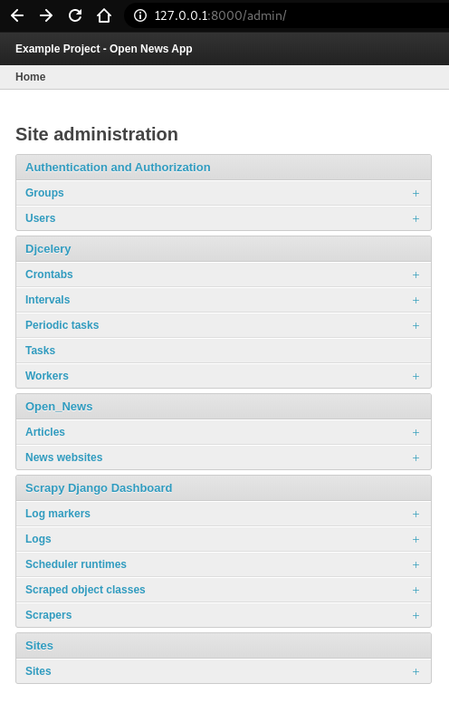

.. note::

  **Overview of Scraper Workflow**

  * The scraper collects the summary of a base element from a ``Main Page (MP)``.
  * If instructed, the scraper continues gathering more information from a ``Detail Page (DP)`` of each base element. 
  * Finally, all items and their attributes scrapped either from a MP or DP, are saved into a database. 

Select ``Scrapy Django Dashboard`` > ``Scrapers`` > ``+ Add Scraper``, and here is the screenshot. 

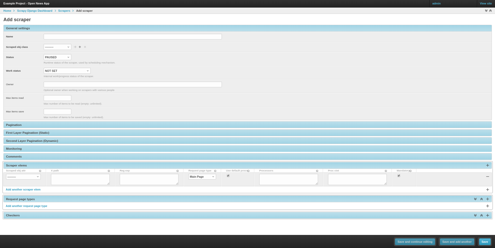

Give the scraper a name ``Wikinews Scraper`` for our ``open news`` app. 

.. _defining_scraped_obj_class:

Defining Scraped Object Class
"""""""""""""""""""""""""""""

Next, we need to define :ref:`scraped_obj_class`. A ``Scraped obj class`` is basically the item which the app scrapes from the source. All attributes associated with this item need to be defined as well. In our example, an Article is the item, and its attributes includes the title, the description, the url and the thumbnail image. Click ``+`` icon and another window pops up. For ``open news`` app, the item name is ``Article``. For its attributes, select one of the following types defined in ``scrapy_django_dashboard.models.ScrapedObjAttr``: ::

  ATTR_TYPE_CHOICES = (
      ('S', 'STANDARD'),
      ('T', 'STANDARD (UPDATE)'),
      ('B', 'BASE'),
      ('U', 'DETAIL_PAGE_URL'),
      ('I', 'IMAGE'),
  )

``BASE`` type is for the base attribute (an arbitrary definition), which is a parent node per se. ``STANDARD``, ``IMAGE`` and ``DETAIL_PAGE_URL`` should be self-explanatory. ``STANDARD (UPDATE)`` allows new updates if there is an existing record. To prevent duplicate entries, we need to use one or more attributes as ``ID Fields``. ``DETAIL_PAGE_URL`` is normally the ideal candidate for this purpose if available. Additionally, :ref:`item_checkers` utilizes ``DETAIL_PAGE_URL`` type attributes to check and remove non-existing records. Here is the screenshot for our example app.

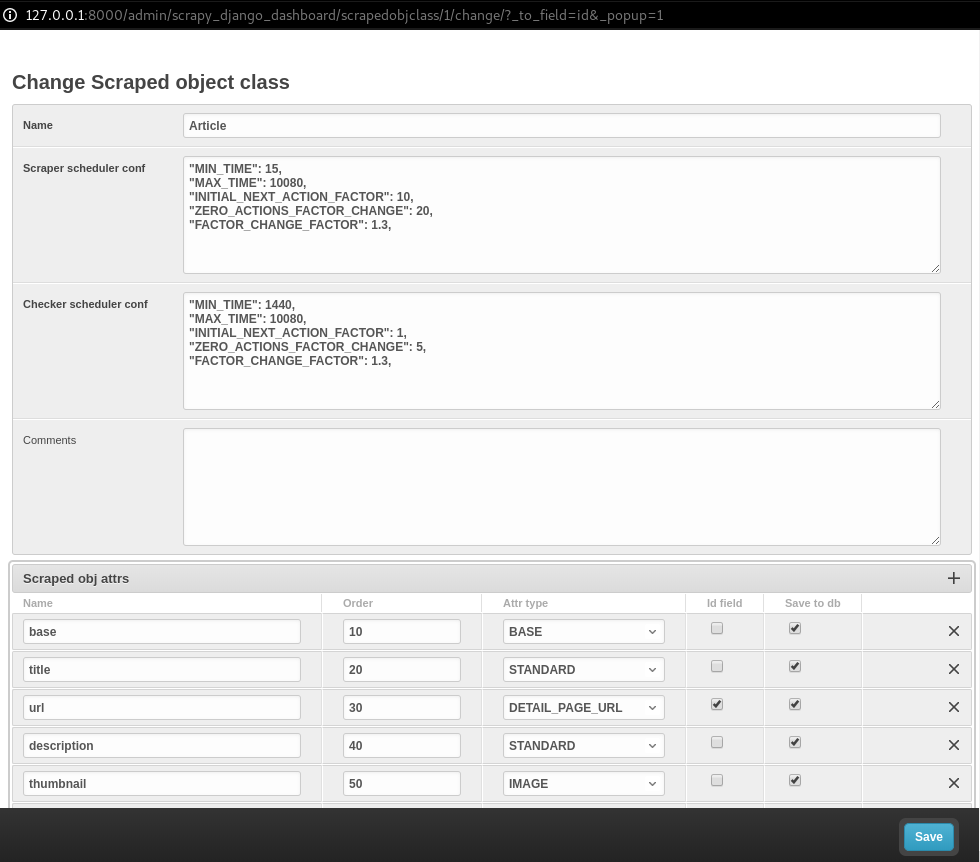

Save the settings. For now, set ``status`` to ``MANUAL``, since we will run the spider from the terminal at the end of this tutorial. Here is what we have achieved so far.  

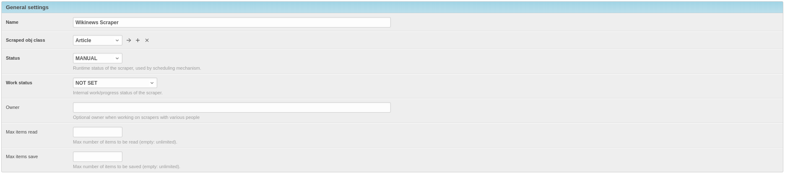

.. note::

   In case of using ``STANDARD (UPDATE)`` type, the process takes **much more page requests**, since the scraper reads a detail page of each item and compares the information against the database. If you are not planning to update the records, select ``STANDARD`` type instead.

.. note::

   The ``order`` of each attribute determines the order listed in ``Scraper elems`` section. Use 10-based or 100-based scale for a easier resorting.

.. _locating_elements:

Locating Elements
"""""""""""""""""

Now, let us move down to ``Scraper elems`` section. Each element corresponds to the attribute we defined in ``Scraped obj class``. By following the customs of Scrapy, we can use ``x_path`` or ``reg_exp`` to locate the information from the source. The ``request_page_type`` decides if the scraper should extract the data a ``Main Page`` or a ``Detail Page``. 

.. note::

  **WARNING**: For every ``request_page_type``, make sure to define a corresponding entry in ``Request page types`` section below. 

``processors`` and ``processors_ctxt`` define the output processors like those in Scrapy's
`Item Loader section`_. For instance, use the processor to add a string to the data or reformat the date. ``mandatory`` dictates whether the data is a required field. The whole item is dropped if the field is not available when ``mandatory`` box is checked. Be sure to "sync" ``mandatory`` checkbox with the corresponding attributes defined in the domain model class, otherwise the item will not be saved in the database.

.. _`Item Loader section`: http://readthedocs.org/docs/scrapy/en/latest/topics/loaders.html

In our example project, Wikinews_ is the source. Here is a screenshot of the html of Wikinews_ main page by using developer tools in Chrome:
 
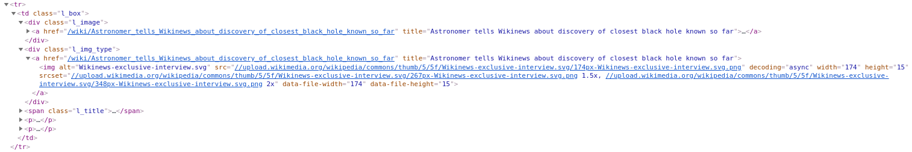

Here is the header tag from the news article detail page:

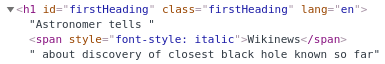

.. note::

   The WikiNews site structure changes over time. Make proper changes when necessary.

Based on those html structures, we formulate the XPATH for each element.

* 1. Define a base element to capture DOM elements for news article summaries. On the main page, all news summaries are enclosed by ``<td>`` tags with a class name ``l_box``, and hence ``//td[@class="l_box"]`` should be sufficient.

* 2. For demonstrating purpose, the code scrapes the news title from the article detail page. As seen in the screenshot above, the article title is enclosed by ``<h1>`` tags with an id ``firstHeading``. ``string(//h1[@id="firstHeading"])`` should give us the headline. Since we want the scraper to get the title text from the detail page instead of the main page, let us select 'Detail Page 1' from the dropdown menu.

.. note::

  You might have considered using ``//h1[@id="firstHeading"]/text()``. The reason why we use ``string()`` is due to the fact that the news titles and short descriptions may contain additional html tags such as ``<i></i>``. In such case, ``text()`` only gets the text up to the first inner element.

  See `StackOverflow`_ discussion.

.. _`StackOverflow`: https://stackoverflow.com/a/10424209/11461544

* 3. All other elements are located relative to the base element. Therefore, be sure to leave out the double slashes. The short description resides within ```` tag with a class name ``l_summary``. The XPath is ``string(p/span[@class="l_summary"])``.

* 4. The XPath of url element is ``span[@class="l_title"]/a/@href``. Since the html only contains the relative path (without the domain), we use a predefined processor called ``pre_url`` to complete the url. Find more about predefined processors in the ``scrapy_django_dashboard.utils.processors`` module - see :ref:`processors`. Processors allows extra information through the ``processors_ctxt`` field, and the data is passed in a dictionary-like format ``'processor_name': 'context'``. For our example, ``'pre_url': 'http://en.wikinews.org'``. 

Finally, this is our ``Scraper elems`` section.

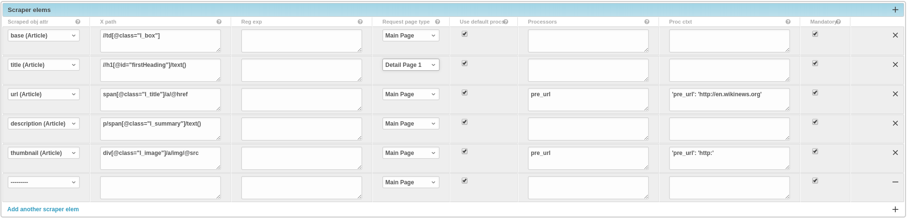

.. note::

   You can also **scrape** attributes of the object **from outside the base element** by using ``..`` notation in XPath expressions to get to the parent nodes!

.. note::

   :ref:`attribute_placeholders` allows you to customize **detail page URLs** with placeholders for **main page attributes** by using ``{ATTRIBUTE_NAME}``.

.. _adding_request_page_types:

Adding Request Page Types
"""""""""""""""""""""""""

For all request page types used in ``Scraper elems`` section above, we need to define the corresponding ``RequestPageType``. We can only have **one** ``Main Page`` type object and up to 25 ``Detail Page`` type objects. In our example, we have one ``Main Page`` type object and one ``Detail Page`` type object.

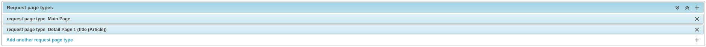

Each ``RequestPageType`` object allows custom content type (``HTML``, ``XML`` or ``JSON``), request method (``GET`` or ``POST``) and more for each individual page type. With this feature, for an example, it is possible to scrape HTML content from the main page and ``JSON`` content from the detail pages. For more information on this topic, see :ref:`advanced_request_options` section.

For this tutorial, we just need to simply set ``Page type`` to ``Detail Page 1`` for ``title`` attribute, and ``Main Page`` for the rest of the attributes. Here are the screenshots for further clarification.

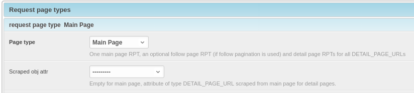

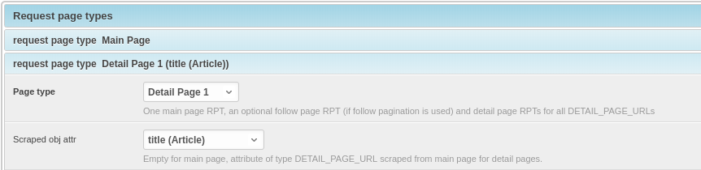

.. _creating_domain_entity:

Creating Domain Entity
^^^^^^^^^^^^^^^^^^^^^^

The last step is to add the reference object of our domain (a ``NewsWebsite`` object for the Wikinews site in our case). Open ``NewsWebsite`` form in Django admin dashboard > ``+ Add news website``, give the object a name 'Wikinews', assign the scraper and create an empty :ref:`scheduler_runtime` object with ``SCRAPER`` as the ``runtime_type``. 

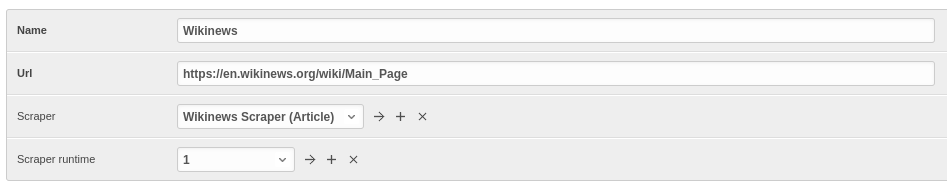

.. _running_scrapers:

Running/Testing Scrapers
------------------------

Running/testing scrapers from the command line is similar to starting Scrapy spiders, with some extra arguments. The command syntax is
as follows: ::

  scrapy crawl [--output=FILE --output-format=FORMAT] SPIDERNAME -a id=REF_OBJECT_ID 
                          [-a do_action=(yes|no) -a run_type=(TASK|SHELL) 
                          -a max_items_read={Int} -a max_items_save={Int}
                          -a max_pages_read={Int}
                          -a start_page=PAGE -a end_page=PAGE
                          -a output_num_mp_response_bodies={Int} -a output_num_dp_response_bodies={Int} ]
  
* ``-a id=REF_OBJECT_ID`` specifies the reference object ID. In our case, it should be the Wikinews ``NewsWebsite`` object (ID = 1) if you have not added other objects before. This argument is mandatory.
  
* By default, the scraped items are not saved in the database. Append ``-a do_action=yes`` otherwise.
  
* ``-a run_type=(TASK|SHELL)`` simulates task-based scraper operations invoked from the command line. It is useful for testing. We can leave out this argument for now.

* ``-a max_items_read={Int}`` and ``-a max_items_save={Int}`` override the scraper params, accordingly.

* ``-a max_pages_read={Int}`` limits the number of pages to read when using pagination.

* ``-a start_page=PAGE`` and/or ``-a end_page=PAGE`` sets the starting page and/or the last page.

* ``-a output_num_mp_response_bodies={Int}`` and ``-a output_num_dp_response_bodies={Int}`` log the complete response body content of the {Int} first main/detail page responses to the terminal for debugging. The beginnings/endings are marked with a unique string in the form of ``RP_MP_{num}_START`` for using full-text search for orientation.

* Scrapy's build-in output options ``--output=FILE`` and ``--output-format=FORMAT`` allows items to be saved as a file. **DO NOT** use this feature with ``-a do_action=yes``

Now, we start Wikinews scraper by running this command: ::

  scrapy crawl article_spider -a id=1 -a do_action=yes  

Here are some news articles logged in the terminal output. 

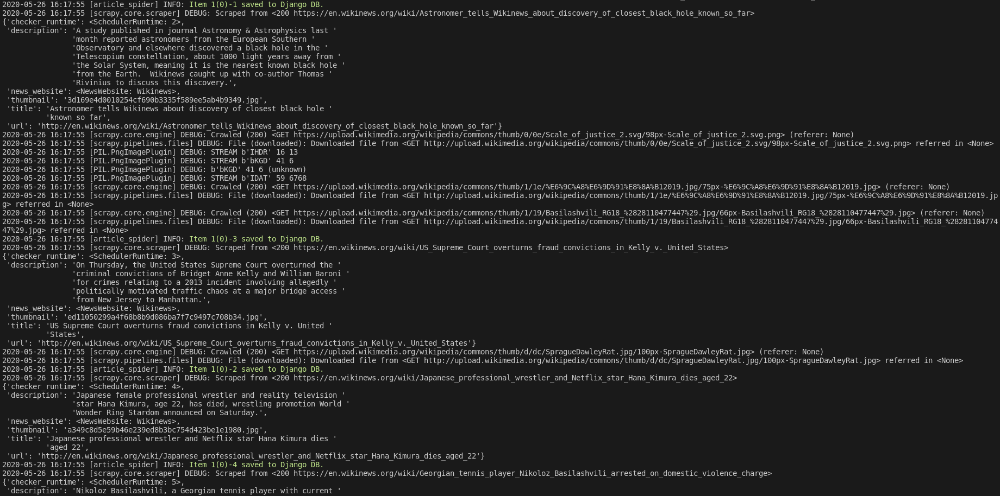

In Django admin dashboard > ``Articles``, we should see the latest articles for Wikinews. 

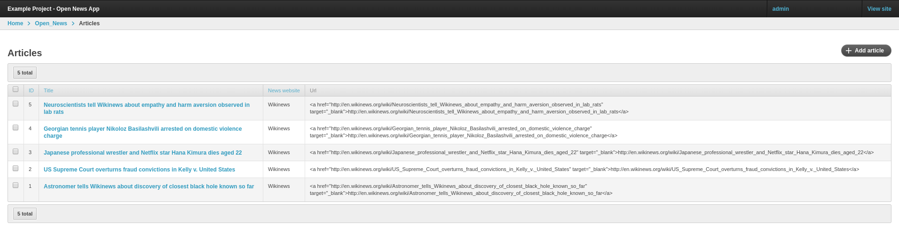
